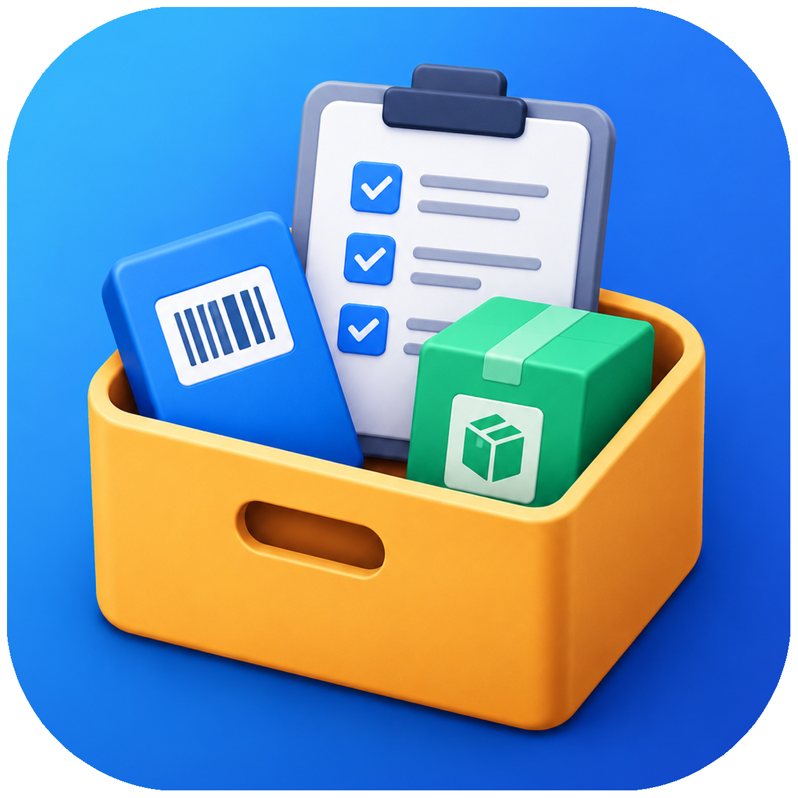
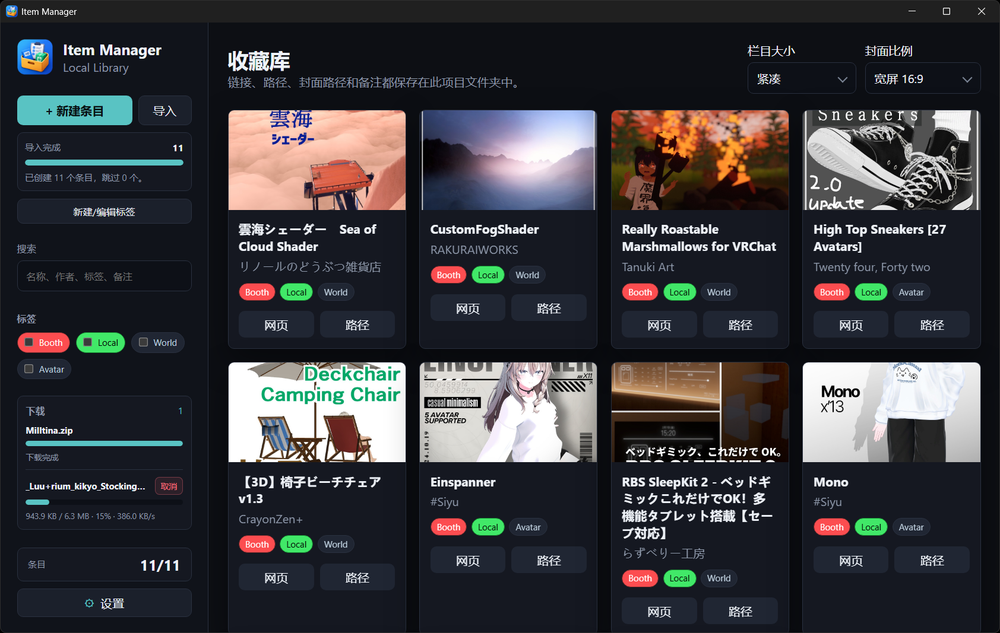

<p align="center">
  
</p>

# Item Manager

**Item Manager 是一个面向 BOOTH 与 VRChat 创作者的本地资源库管理工具。**

<p align="center">
  
</p>

它可以用于整理下载的模型、服装、素材和其他文件，支持封面、作者、标签、备注、网页链接和本地目录等信息。

应用也可以接管 BOOTH 的 `DL with Booth Library Manager`。从而下载商品文件、创建本地目录，并自动建立资源库条目。

所有条目和设置均保存在本地，无需登录，也不依赖云端服务。

## 功能特色

- 管理任意文件、文件夹和网页资源，不限于 BOOTH 商品
- 使用自定义标签对资源进行分类
- 按名称、作者、标签和备注搜索条目
- 为条目保存封面、商品网页、本地目录和备注
- 批量读取文件夹并创建条目
- 支持将文件或文件夹拖入窗口快速创建条目
- 接管 `DL with Booth Library Manager` 下载链接
- 自动创建 BOOTH 商品目录并抓取商品信息
- 支持系统代理
- 本地 JSON 数据存储，便于迁移和备份
- 无需安装的 Windows 便携版

## 功能对比

| 功能 | Item Manager | Booth Library Manager |
| :--: | -- | -- |
| 手动创建条目 | ✓ | ✓ |
| 批量导入本地目录 | ✓ | — |
| 拖拽文件或文件夹导入 | ✓ | — |
| `DL with Booth Library Manager` | ✓ | ✓ |
| 管理任意本地资源 | ✓ | — |
| 标签分类 | ✓ | — |
| 列表分类 | — | ✓ |
| 搜索名称与作者 | ✓ | ✓ |
| 搜索标签与备注 | ✓ | — |
| 本地数据备份 | ✓ | 仅限下载文件 |
| 系统代理支持 | ✓ | 部分网络环境可能需要 TUN |
| BOOTH 商品更新通知 | — | ✓ |

## 下载与安装

### 下载便携版

1. 前往项目的 [Releases](https://github.com/Hrenact/ItemManager/releases) 页面。
2. 下载最新 build 的 `Item Manager-<版本号>-win.zip`。
3. 将压缩包完整解压到一个有写入权限的目录。
4. 运行解压目录中的 `Item Manager.exe`。

**Item Manager 是便携版应用，不需要安装。**

请不要只复制 `Item Manager.exe`。Electron 运行库和其他资源文件也必须保留在原目录结构中。

如果 Releases 页面暂时没有可下载版本，可以按照文末的“二次开发”说明从源码构建。

## 基本使用

### 创建条目

你可以通过以下方式来快速创建条目：

| 方式 | 行为 |
| -- | -- |
| 点击 `新建条目` | 手动填写条目信息 |
| 点击 `导入` | 读取所选文件夹中的第一层目录并批量创建条目 |
| 拖入文件或文件夹 | 打开新建窗口并自动填写本地路径 |
| Booth `DL with Booth Library Manager` | 下载文件、抓取商品信息并自动创建条目 |

### 编辑条目

点击已有条目卡即可进行编辑。

每个条目可以保存：

- 标题与作者
- 商品网页链接
- 本地文件或文件夹路径
- 封面图片
- 标签
- 备注

建议将 `本地路径` 设置为商品所在的文件夹，而不是其中某个具体文件。这样即使一个商品包含多个压缩包或附件，也可以从同一个条目打开完整目录。

### 自动识别 BOOTH 商品

填写 `网页链接` 或 `本地路径` 时，Item Manager 可以识别部分 BOOTH 格式，并询问是否自动获取其余商品信息。

支持的 `网页链接` 格式：

```text
https://booth.pm/语言/items/商品编号
https://子域名.booth.pm/items/商品编号

例：
https://booth.pm/zh-cn/items/6306337
https://hrenact.booth.pm/items/6306337
```

支持的 `本地目录` 格式：

```text
D:\...路径...\b + 商品编号

例：
D:\flies\Booth\b6306337
```

### 标签管理

点击 `新建/编辑标签` 可以创建和修改标签。

标签支持：

- 自定义名称
- 自定义背景、文字和边框颜色
- 随机生成配色
- 恢复默认配色
- 使用屏幕取色器选取颜色
- 在左侧标签列表中拖拽排序

标签适合按平台、资源类型、适用模型、制作状态或其他个人习惯对资源进行分类。

### 软件设置

点击左下角的 `设置` 按钮，可以配置：

- **关联 URL 快捷方式**<br>让 Item Manager 处理 `DL with Booth Library Manager` 链接。
- **文件下载保存目录**<br>设置所有 BOOTH 下载内容使用的统一根目录。
- **允许打开 DevTools**<br>启用后可使用 `F12` 或 `Ctrl + Shift + I` 打开开发者工具。

下载目录应选择长期可用，并且当前 Windows 用户拥有写入权限的位置，例如：

```text
C:\Users\<用户名>\Downloads\BOOTH
```

## 通过 BOOTH 下载文件

### 首次配置

1. 打开左下角的 `设置`
2. 选择 `文件下载保存目录`
3. 启用 `将该应用关联 URL 快捷方式 booth-library-manager://`
4. 保存设置

之后在 [Booth 库存页面](https://accounts.booth.pm/library) 内的任意一个商品下载选项选择：

 `Other Downloads` > `DL with Booth Library Manager`
 
Windows 会唤醒 Item Manager 并开始下载。

可以使用以下无下载任务链接测试协议关联：

```text
booth-library-manager://ItemManager/OpenApp
```

如果尚未设置下载目录，应用会拒绝下载并提示先完成设置。

### 文件保存方式

每个 BOOTH 商品都会在下载根目录下使用独立文件夹，名称格式为 `b + item_id`。例如商品编号为 `6306337` 时，文件会保存在：

```text
<下载根目录>\b6306337\
```

同一商品的多个文件会保存在同一个文件夹内，条目的本地路径也会指向该文件夹。

如果目标文件名已经存在，Item Manager 不会覆盖原文件，而是自动添加编号：

```text
asset.zip
asset (1).zip
asset (2).zip
```

### 下载任务

下载过程中，软件左侧会显示下载列表，包括：

- 文件名
- 下载进度
- 下载速度

下载任务可以随时取消。

未完成内容会先写入隐藏的 `.part` 临时文件。只有下载成功后，临时文件才会被重命名为最终文件名。取消或失败时，应用会关闭文件句柄并尝试清理未完成文件。

下载完成后，Item Manager 会尝试从 BOOTH 商品页获取：

- 商品标题
- 店铺名称
- 商品封面
- 商品网页地址
- 本地保存目录

如果商品信息抓取失败，已经下载的文件不会被删除。应用会根据现有文件名和下载信息创建一个基础条目。

如果资源库中已经存在相同商品编号的条目，下载文件仍会保留，但不会创建重复条目。

## 数据存放与备份

首次启动后，Item Manager 会在 `Item Manager.exe` 所在目录旁创建 `data` 文件夹。

其中保存：

| 名称 | 内容 |
| -- | -- |
| data/items.json | 条目数据 |
| data/tags.json | 标签数据 |
| data/settings.json | 应用设置 |
| data/ | 封面缓存及其他运行数据 |

迁移或备份应用时，最简单的方法是直接复制整个 Item Manager 文件夹。

分享应用压缩包前，请检查并移除自己的 `data` 文件夹，避免将个人资源库信息一起发送。

## 常见问题

### `DL with Booth Library Manager` 打开了其它应用

BOOTH Library Manager 也会注册相同的系统协议。Windows 通常只会保留一个当前处理程序，因此最后注册的应用可能覆盖之前的关联。

Item Manager 只有在便携版中且设置项已勾选时才会注册该协议，并会在每次启动时重新确认关联。若链接再次打开了其他应用，请先关闭其他相关程序，再启动 Item Manager；必要时取消勾选、保存，然后重新勾选并保存。

可以尝试：

1. 关闭其他相关应用
2. 启动 Item Manager
3. 打开设置，取消协议关联并保存
4. 再次启用协议关联并保存
5. 使用测试链接重新验证

```text
booth-library-manager://ItemManager/OpenApp
```

开发模式不会注册系统协议，避免链接被错误关联到 Electron 开发环境。

### 点击 `DL with Booth Library Manager` 后没有反应

请检查：

- Item Manager 是否为完整解压后的便携版
- 是否已经设置下载保存目录
- 是否启用了协议关联
- 协议是否被其他应用覆盖
- 是否正在使用 Electron 桌面版，而不是仅运行 `npm start`

### 下载提示 `403` 或其它错误

BOOTH 下载地址通常是带签名且具有有效期的临时链接。

如果链接已经过期，服务器可能返回 `403`。请返回 [Booth 库存页面](https://accounts.booth.pm/library)，重新点击 `DL with Booth Library Manager` 以获取新的链接。

### 下载失败后仍存在 `.part` 文件

应用会在取消或失败后尝试删除 `.part` 文件。

如果文件正被杀毒软件、压缩工具或其他程序占用，清理可能会稍有延迟。关闭相关程序后可以手动删除该临时文件。

### 可以只运行 Item Manager.exe 吗？

不可以。

`Item Manager.exe` 依赖同目录中的 Electron 运行库和资源文件。请保留 ZIP 解压后的完整目录结构。

### 注意事项

- 应用仅接受 HTTPS 的 BOOTH 下载地址，并会检查重定向目标
- 下载目录被移动、删除或失去写入权限后，需要在设置中重新选择
- 下载过程中不要移动应用目录或下载根目录
- DevTools 默认关闭，普通使用时建议保持关闭
- `npm start` 只提供浏览器界面，不支持系统协议唤醒和完整的 Electron 下载集成
- 当前尚未实现 BOOTH 商品更新通知

## 二次开发

### 环境要求

- Windows 10 或 Windows 11
- 当前 Node.js LTS 版本
- npm
- Git

### 安装依赖

```powershell
git clone https://github.com/Hrenact/ItemManager.git
cd ItemManager
npm install
```

### 启动 Electron 开发版

```powershell
npm run electron
```

# 仅启动本地网页服务

```powershell
npm start
```

网页服务仅监听 `127.0.0.1`，适合调试界面和本地 API，但不提供完整的 Electron 协议处理能力。

### 项目结构

```text
ItemManager/
├─ electron-main.js Electron 生命周期、协议注册与文件下载
├─ preload.js 渲染进程可使用的受限 IPC 接口
├─ server.js 本地 API、JSON 存储与 BOOTH 信息抓取
│
├─ public/
│ ├─ index.html 主界面结构
│ ├─ app.js 前端交互逻辑
│ └─ styles.css 界面样式
│
├─ data/ 默认数据与开发环境数据
├─ image/ README.md 图片资源
├─ build/ Windows 图标与打包资源
└─ tests/ item-import 冒烟测试辅助脚本
```

### 构建 Windows 便携版

```powershell
npm run dist
```

构建完成后会生成：

```text
release\win-unpacked\Item Manager.exe
release\Item Manager-<版本号>-win.zip
```

协议关联必须使用打包后的 `Item Manager.exe` 进行验证。开发环境中的 Electron 可执行文件仅用于承载应用，不应注册为正式协议处理程序。

修改代码后，建议至少完成以下检查：

1. `npm run dist` 可以正常生成目录版和 ZIP
2. `release\win-unpacked\Item Manager.exe` 可以正常启动
3. 新建、编辑、导入、标签和设置功能正常
4. 本地文件与文件夹路径可以正常打开
5. `booth-library-manager://ItemManager/OpenApp` 可以唤醒应用
6. BOOTH 下载、取消、重复文件名和失败清理正常
7. 已存在相同商品编号时不会重复创建条目